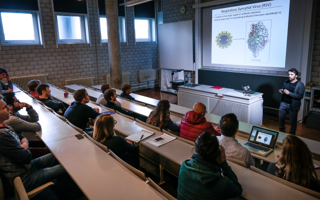

# SIB Training Cookbook

This Cookbook contains the workflow of the SIB training topics and procedures about creating/organising/managing a course from the perspective of the Trainer, the Coordinator and the Admin.

The procedures will guide the Coordinator on how to coordinate the development of a course.

